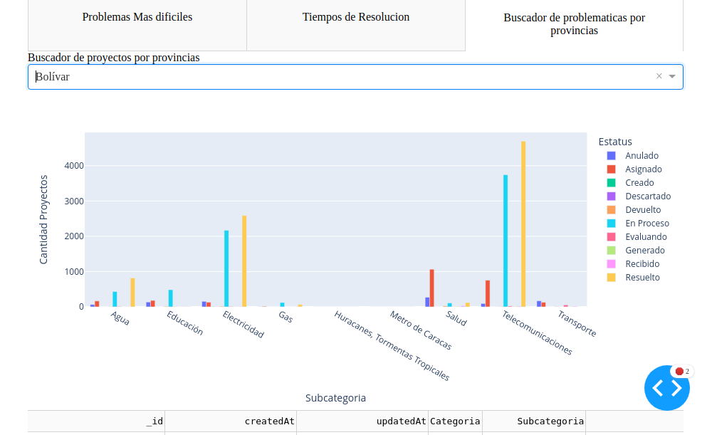
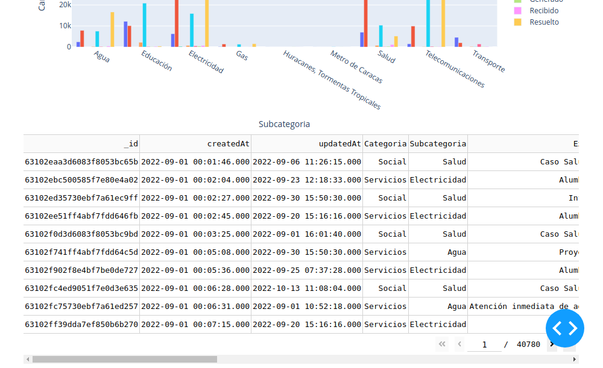
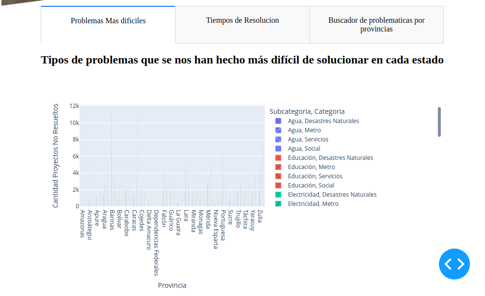
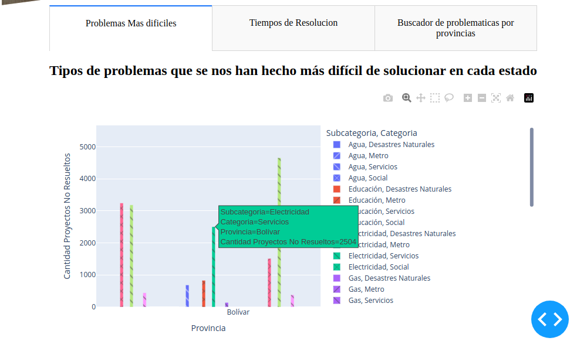
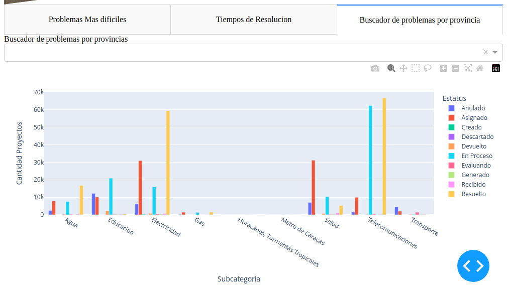
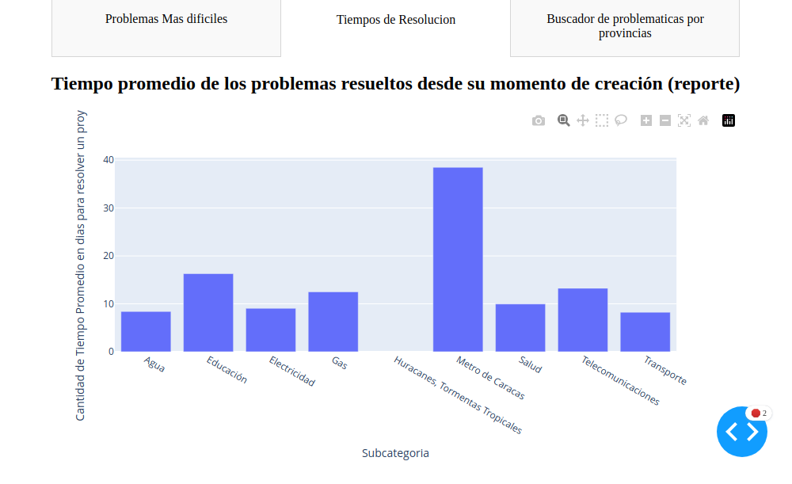
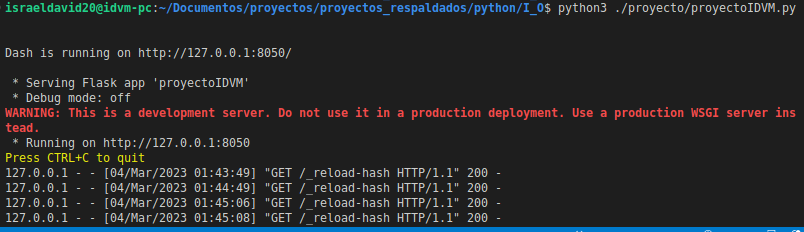

<!-- START doctoc generated TOC please keep comment here to allow auto update -->
<!-- DON'T EDIT THIS SECTION, INSTEAD RE-RUN doctoc TO UPDATE -->
**Table of Contents**  *generated with [DocToc](https://github.com/thlorenz/doctoc)*

- [data-science-application-to-municipal-problems](#data-science-application-to-municipal-problems)
  - [data-science-application-to-municipal-problems](#data-science-application-to-municipal-problems-1)
  - [Licencia](#licencia)
  - [Caracteristicas ¿Qué te ofrece?](#caracteristicas-%C2%BFqu%C3%A9-te-ofrece)
  - [Features to implement / Caracteristicas a implementar](#features-to-implement--caracteristicas-a-implementar)
  - [Planning, Requirements Engineering and risk management / Planeacion, Ingenieria de Requerimientos y gestion del riesgo](#planning-requirements-engineering-and-risk-management--planeacion-ingenieria-de-requerimientos-y-gestion-del-riesgo)
  - [Uso:](#uso)
    - [Instala python](#instala-python)
    - [Instala pip3](#instala-pip3)
      - [Crear entorno virtual y usar](#crear-entorno-virtual-y-usar)
    - [Instalar dependencias:](#instalar-dependencias)
    - [Ejecutar el proyecto archivo proyectoIDVM.py](#ejecutar-el-proyecto-archivo-proyectoidvmpy)
    - [Estructura de la app:](#estructura-de-la-app)
    - [Necesitamos analizar cuales son los tipos de problemas que se nos han hecho más difícil de solucionar en cada estado.](#necesitamos-analizar-cuales-son-los-tipos-de-problemas-que-se-nos-han-hecho-m%C3%A1s-dif%C3%ADcil-de-solucionar-en-cada-estado)
    - [Realizar un análisis sobre las principales problemáticas de las provincias: Caracas, Bolívar y Portuguesa.](#realizar-un-an%C3%A1lisis-sobre-las-principales-problem%C3%A1ticas-de-las-provincias-caracas-bol%C3%ADvar-y-portuguesa)
      - [Imagen del buscador sin especificar una provincia(Realiza un pequeño resumen de todas)](#imagen-del-buscador-sin-especificar-una-provinciarealiza-un-peque%C3%B1o-resumen-de-todas)
      - [Imagen del buscador especificando a Bolívar como provincia](#imagen-del-buscador-especificando-a-bol%C3%ADvar-como-provincia)
    - [Analizar los reportes “Resueltos” y que tiempo promedio transcurrido desde su momento de creación, desglosado por subcategoría.](#analizar-los-reportes-resueltos-y-que-tiempo-promedio-transcurrido-desde-su-momento-de-creaci%C3%B3n-desglosado-por-subcategor%C3%ADa)
      - [Histograma interactivo de los tiempos de resolución:](#histograma-interactivo-de-los-tiempos-de-resoluci%C3%B3n)
  - [Software Design / Diseño de Software](#software-design--dise%C3%B1o-de-software)
    - [Perspectiva Estructural](#perspectiva-estructural)
      - [Vista Logica de la Arquitectura del software](#vista-logica-de-la-arquitectura-del-software)
    - [Perspectiva de comportamiento](#perspectiva-de-comportamiento)
  - [Technical decisions / Decisiones Tecnicas](#technical-decisions--decisiones-tecnicas)
    - [Make a donation. Your contribution will make a difference.](#make-a-donation-your-contribution-will-make-a-difference)
    - [Find me on:](#find-me-on)

<!-- END doctoc generated TOC please keep comment here to allow auto update -->

# data-science-application-to-municipal-problems

[Readme version in English](./README-EN.md)

## data-science-application-to-municipal-problems




Esta aplicación en Python está diseñada para analizar una base de datos de reportes de usuarios que describen problemáticas y necesidades en sus comunidades. 


## Licencia

Este código tiene licencia bajo la licencia pública general de GNU versión 3.0 o posterior (LGPLV3+). Puede encontrar una copia completa de la licencia en https://www.gnu.org/licenses/lgpl-3.0-standalone.htmlalone.html0-standalone.html

## Caracteristicas ¿Qué te ofrece?

- Histograma interactivo de los tipos de problemas:



Dicho histograma es de carácter interactivo, permitiendo hacer zoom, desplazarse entre los diferentes provincias etc



- Componente analizador de problemáticas por provincia

Buscador sin especificar una provincia(Realiza un pequeño resumen de todas)




Buscador especificando a Bolívar como provincia


- Histograma interactivo de los tiempos de resolución:



## Features to implement / Caracteristicas a implementar

## Planning, Requirements Engineering and risk management / Planeacion, Ingenieria de Requerimientos y gestion del riesgo

Estas secciones del proyecto se llevara por medio de un sitio en notion de forma que puedan ser facilmente accesibles por el personal no tecnico.

Solicita el link de acceso al personal autorizado

## Uso:

### Instala python
sudo apt update
sudo apt install python3
### Instala pip3
sudo apt update
sudo apt install python3-pip

#### Crear entorno virtual y usar
python3 -m venv venv

### Ejecuta
source venv/bin/activate

### Instalar dependencias:
pip3 install dash
pip3 install pandas
pip install openpyxl
### Ejecutar el proyecto archivo proyectoIDVM.py
dentro de la carpeta donde esta el proyecto invocamos al interprete de python pasandole el archivo del proyecto

python3 proyectoIDVM.py

lo cual deberia de generar una salida como la que se muestra en pantalla



Notese que el warning nace de que se esta usando flask que proporciona un servidor local que no tiene las proteciones para ser usado en produccion para hacer funcionar la app para llevar la app a produccion deberiamos usar un servidor dedicado a estos fines.

### Estructura de la app:

Assets: 
carpeta con los archivos de estilos y las imagenes de la app
proyectoIDVM.py:
 archivo con el script de python
reports_TEST.xlsc: 
archivo con la hoja de calculo donde se encuentran los datos

### Necesitamos analizar cuales son los tipos de problemas que se nos han hecho más difícil de solucionar en cada estado.

Histograma interactivo de los tipos de problemas:
Para dar solución al requerimiento se implemento un histograma donde se muestran los tipos de problemas. 

Histograma interactivo de los tipos de problemas:


Dicho histograma es de carácter interactivo, permitiendo hacer zoom, desplazarse entre los diferentes provincias etc


Componente analizador de problemáticas por provincia

### Realizar un análisis sobre las principales problemáticas de las provincias: Caracas, Bolívar y Portuguesa.

Componente analizador de problemáticas por provincia:

Para ello se implemento un componente capaz de generar 2  tipos de visualizaciones: un gráfico que resume las principales problemáticas, una tabla donde se detallan dichas problemáticas. 

Dichas visualizaciones se generan de forma dinámica por medio de un buscador que es capaz de generar cambios dinámicos de acuerdo a una provincia.

Dicho componente funciona de la siguiente manera: 
Si se desea obtener la información para una determinada provincia se selecciona una de ellas por medio del buscador, lo cual ajustara las 2 visualizaciones anteriores ajustadas a la provincia especificada. 
En caso de no especificar una provincia especifica arroja un resumen de las problemáticas de todas las provincias.

#### Imagen del buscador sin especificar una provincia(Realiza un pequeño resumen de todas)


#### Imagen del buscador especificando a Bolívar como provincia


### Analizar los reportes “Resueltos” y que tiempo promedio transcurrido desde su momento de creación, desglosado por subcategoría.

#### Histograma interactivo de los tiempos de resolución:

Para  ello se implemento otro histograma, tal y como se muestra en la siguiente figura.


<!-- 
### Requisitos de configuración del servidor
Dado algunas de las configuraciones para la seguridad informática que poseen algunos navegadores, es necesario que dicha pagina se encuentre en un servidor y además que use el https

Por consiguiente y para fines de este proyecto se levantara un servidor http local básico que solo cargue la pagina y se conectara por medio de la herramienta ngrok un túnel a un servidor que si ofrezca https   

#### Levantar servidor web local básico:

Para esto puedes usar cualquier servidor, pero aquí hay una forma de hacerlo:

- Descarga Python3 

- Abre una línea de comandos o terminal

- Navega hasta la carpeta donde 

- Ejecuta el comando 
``` python3 -m http.server <numeroPuertoServidorLocal> ```

#### Crear túnel con servidor remoto con https

Puedes hacer un túnel de HTTPS siguiendo los siguientes pasos

- Descarga ngrok en tu computadora, y descomprímelo

- Abre una línea de comandos o terminal

- Navega hasta la carpeta donde descargaste ngrok

- Ejecuta el comando 
``` ngrok http <numeroPuertoServidorLocal> ```

Dado que nosotros tenemos un dominio asociado a ngrok usaremos el comando

```ngrok http --domain=apt-kid-privately.ngrok-free.app <numeroPuertoServidorLocal>```

#### Acceso a la app
Es importante tener ambos activos: El servidor de python, y el túnel de ngrok

Luego de ejecutar el comando de ngrok aparecerá un enlace HTTPS. 

Abre un explorador en tu celular y ve al enlace HTTPS indicado  En nuestro caso dado que ya teniamos un dominio asociado sera https://apt-kid-privately.ngrok-free.app -->


## Software Design / Diseño de Software

### Perspectiva Estructural

#### Vista Logica de la Arquitectura del software 

En el siguiente diagrama de clases se veran las abstracciones clave en el sistema, sus interaciones responsabilidades.


<!-- classDiagram
    
    class DatabaseAuditor{
    
    }

    note for DatabaseAuditor "Busca ser el contexto para las distintas estrategias usadas
    y un medio que encapsula funciones utilitarias 
    comunes para todos los algoritmos"

    DatabaseAuditor ..> DatabaseSchemaGenerator

    class DatabaseSchemaGenerator{
        <<Abstract>>
        +databaseAuditor
        +generate()
    }

    note for DatabaseSchemaGenerator "Proporciona la interfaz estrategia 
    que es común a todas las estrategias concretas 
    para la generacion de los 
    esquemas de la base de datos"

    DatabaseSchemaGenerator ..> SchemaFromDBUsingName
    DatabaseSchemaGenerator ..> SchemaFromJSON

    class SchemaFromJSON{
        +databaseAuditor
        +generate()
    }

    class SchemaFromDBUsingName{
        +databaseAuditor
        +generate()
    }

    note for SchemaFromDBUsingName "Es una de las estrategias concretas 
    que genera los esquemas por medio de los nombres
     de las convenciones de nombres de la base de datos"

    DatabaseAuditor ..> ValidationAlgorithm

    note for ValidationAlgorithm "Proporciona la interfaz estrategia 
    que es común a todas las estrategias concretas 
    para la generacion de las 
    validaciones de la base de datos"

    class ValidationAlgorithm{
        <<Abstract>>
        +execute()
    }

    ValidationAlgorithm <|-- NonAdditiveConcatenation
    ValidationAlgorithm <|-- VerificationBCNF


    class VerificationNonAdditiveConcatenation{
        +databaseAuditor
        +execute()
    }


    note for NonAdditiveConcatenation "Encapsula el Algoritmo 11.1 de Verificación 
de la propiedad de concatenación no aditiva propuesto por RAMEZ ELMASRI 
y SHAMKANT B. NAVATHE"

    class VerificationBCNF{
        +databaseAuditor
        +execute()
    }

    note for NonAdditiveConcatenation "Encapsula el Algoritmo que valida que cada 
    descomposicion posea la BCNF 
    en base a la definicion presentada 
    por RAMEZ ELMASRI y SHAMKANT B. NAVATHE"

    DatabaseAuditor <.. Client

    class Client{

    } -->


### Perspectiva de comportamiento


## Technical decisions / Decisiones Tecnicas

Para dar solución al problema se construyo una aplicacion en python utilizando:
La librería Dash la cual, hizo posible la creacion del dashboards interactivo, los gráficos, tablas y otros elementos visuales. Cabe destacar que de forma interna dash utiliza al microframework Flask y la biblioteca React.js.
La librería Plotly Express la cual permite facilitar un poco mas la creación de gráficos complejos, cabe destacar que esta a su vez se basa en la biblioteca de gráficos Plotly
La librería pandas que facilito el trabajar con datos tabulares, como el presente en archivo de hoja de cálculo reports_TEST.xlsx, a la vez que permitio realizar una amplia variedad de operaciones, como filtrado, agrupamiento, ordenamiento, trabajo con fechas, cálculo de estadística, etc.

### Make a donation. Your contribution will make a difference.
[](https://ko-fi.com/israeldavidvm)
[](https://paypal.me/israeldavidvm)
[](https://www.binance.com/activity/referral-entry/CPA?ref=CPA_004ZGH9EIS)

### Find me on:
[](https://github.com/israeldavidvm)
[](https://www.linkedin.com/in/israeldavidvm/)
[](https://twitter.com/israeldavidvm)
[](https://www.facebook.com/israeldavidvm)
[](https://www.instagram.com/israeldavidvm/)
[](https://www.tiktok.com/@israeldavidvm)
[](https://www.youtube.com/channel/UCmZLFpEPNdwpJOhal0wry7A)

